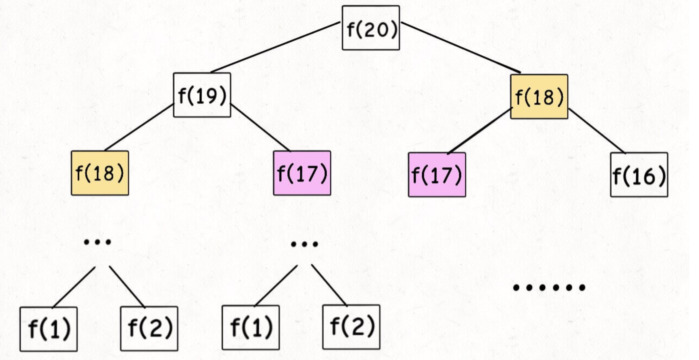

## 斐波那契数列
> 非严格意义上的动态规划, 没有求最值, 但是很好表现了**子问题的重叠性**

通常用 `F(n)` 表示, 形成的序列称为斐波那契数列。该数列由 `0` 和 `1` 开始, 后面的每一项数字都是前面两项数字的和。也就是:
```
F(0) = 0,   F(1) = 1
F(N) = F(N - 1) + F(N - 2), 其中 N > 1.
```
给定 `N`, 计算 `F(N)`。

`0 ≤ N ≤ 30`。

审完题, 可以很快的得到下列公式(复杂度 O<sub>(2<sup>n</sup>)</sub>):
```js
function fib(n) {
    if(n === 0) return 0;
    if(n === 1 || n === 2) return 1;

    return fib(n - 1) + fib(n - 2);
}
```

假设 `N` 为 `20`, 整理计算过程之后得到如下的二叉树:


通过上图可以得知, 其中有大量的重复计算过程, 这个过程随 `N` 的增大呈指数变化。

接下来需要解决的问题就是如何规避多次重复计算问题, 采用备忘录:
```js
// 数组也可以
const fibMap = new Map([
    [0, 0],
    [1, 1],
]);

function fib(n) {
    if(n === 0) return 0;
    if (n === 1 || n === 2) return 1;

    return helper(n);
}

function helper(n) {
    // 已经计算过, 直接返回
    if (fibMap.get(n) !== undefined) return fibMap.get(n);

    fibMap.set(n, helper(n - 1) + helper(n - 2));
    return fibMap.get(n);
}
```

当前结果时间复杂度 O<sub>(n)</sub>。

当前采用备忘录的算法是`自顶向下`的(`20` 开始), 而正常的动态规划问题通常`自底向上`开始计算, 修改为 `dp 数组`:
```js
function fib(n) {
    const dp = [ 0, 1, 1];
    for (let i = 3; i <= n; i++)
        dp[i] = dp[i - 1] + dp[i - 2];
    return dp[n];
}
```